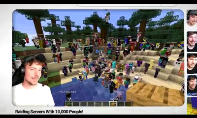
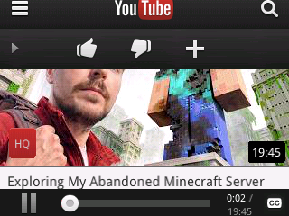

<!-- markdownlint-disable MD007 MD009 MD033 MD059 -->
# <div align="center">BlazerTube</div><p>

<div align="center">
A (Work in Progress) Native YouTube 3DS app Revival
<br>
<br>

<br><br>
<a href="https://github.com/idkwhere1sthisname/blazertube#installation">Jump to installation guide</a>
<br>

## Screenshots


<br/>

</div>
<br>
<hr>

## Installation

### Manual install

Instructions are available [here](https://drive.google.com/drive/folders/1LzL-bQ5w_wqftXQo9PqupN4Zr16YdcoM), in the `README` file

### UniStore install (recommended)

You can alternatively scan this QR code with [Universal Updater](https://universal-team.net/projects/universal-updater)

<div align="center"></div>

This allows you to install updates to BlazerTube without having to manually replace the binary in your system.

## Self hosting

See [this guide](/self_host_guide.md) to learn how self host your own instance, and [these docs](DOCS.md) if you want to know how the apps and backend work

## Working features

- Playing short videos (unless using a New 3DS)
    - Videos can be toggled between 144p and 240p on Old 3DS consoles, otherwise they're locked to 360p on New 3DS consoles
- Sign in (doesn't work with multiple accounts)
    - Includes (dis)liking videos, (un)subscribing from channels, adding/removing from playlists, Watch Later, Liked Videos, video recommendations, viewing uploaded videos, etc...
- Pairing with TV/Console
    - This renders the 3DS app more prone to crashes as it was never meant to do that probably
- Pagination
- Searching playlists, channels and videos
- Topic channels (e.g. News, Music, etc)
- Browsing recommended channels
- Region/language switching
- Safety mode (called safe mode in the app itself)
- Creating playlists (only when using the public Data API login system)
- Playing shorts

## Known bugs

- Random crashes (the 3DS app sucks unfortunately)
- Longer videos take a long time to play
- Captions do not work
- Opening settings twice reloads the page

## Todo

- Channel switcher
- Viewing personal playlists
- Actual channel topics (instead of it being a shortcut to search)(?)
- Adding inbox and social if possible
- Adding videos to watch history when watched
- Reporting videos in app

## FAQ

- Videos don't play / play with lag (o3DS) on the public instance
    - This is a known bug, and it will be fixed eventually

## Support

Open an issue describing clearly the problem you're facing. Remember to add information like your Python version and OS.

To get information about your OS and Python version, run the following in the terminal:

```bash
python -c "import platform; print('python version:', platform.python_version(), '(build', platform.python_build()), '\nuname:', platform.uname())"
# (e.g.)
# -> python version: 3.13.13 (build ('tags/v3.13.13:01104ce', 'Apr  7 2026 19:25:48')
# -> uname: uname_result(system='Windows', node='PC-NAME', release='11', version='10.0.26200', machine='AMD64')
```

## Credits

[idkwh](https://github.com/idkwhere1sthisname): Developer

[NebulaGamez](https://github.com/nebnebgamez): Developer

[Tanjirokamado12](https://github.com/Tanjirokamado12): [Inject](/patcher/lib/inject.py) portion of the patcher

[Liinback](https://github.com/liinbacklite): [Video loader](/video.py), [captions](/captions.py), [debug](/debug.py) and small portions of [youtubei.py](/youtubei.py). The captions and video modules are based off of [Liinback 3.5](https://github.com/liinbacklite/Liinback)'s implementation, while the debug module is based on Liinback 3.0's implementation.

[RiiviveTube](https://github.com/ReviveMii/RiiviveTube): Portions of [youtubei.py](/youtubei.py)
